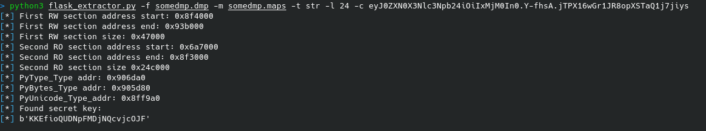

# flask_extractor
Tool for extracting FLASK session secret keys from a memory dump

Currently supports trying to find it from bytestring or string objects. Let me know if there are other types which can be used.

If you use it on a distribution or version where it doesn't work, let me know.

## Dependencies
flask_extractor depends on flask_unsign
```
pip3 install flask-unsign
```

flask_dumper depends on nothing

## Usage

First dump a flask sessions memory using flask_dumper.py

```
python3 flask_dumper.py -p <PID> -o <optional output file prefx>
```

The dumper will always output the file with the prefix given and a .dmp and .maps extension.

Eg. output file prefix "abcd" will generate a file called "abcd.dmp" and "abcd.maps"

Then parse it using flask_extractor.py. If you have no idea what the key length is or the type of the key, you can just specify the .dmp and .maps file and it will try to brute force it (may take some time)

```
python3 flask_extractor.py -f <.dmp file> -m <.maps file> 
```

If you'd like to speed up the process significantly you can specify a length

```
python3 flask_extractor.py -f <.dmp file> -m <.maps file> -l 24
```

If the extractor can't find a valid session cookie inside the dump you can also specify your own

```
python3 flask_extractor.py -f <.dmp file> -m <.maps file> -c <valid session cookie>
```

If you already know the type of the variable you can also speed up the process by specifying the type

```
python3 flask_extractor.py -f <.dmp file> -m <.maps file> -t str
```

Example of using them all together:

